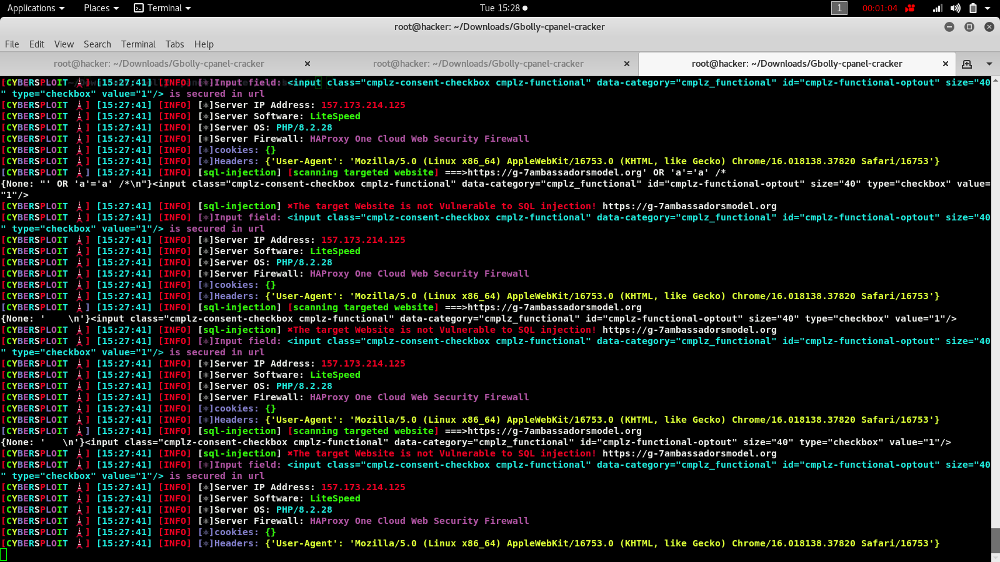
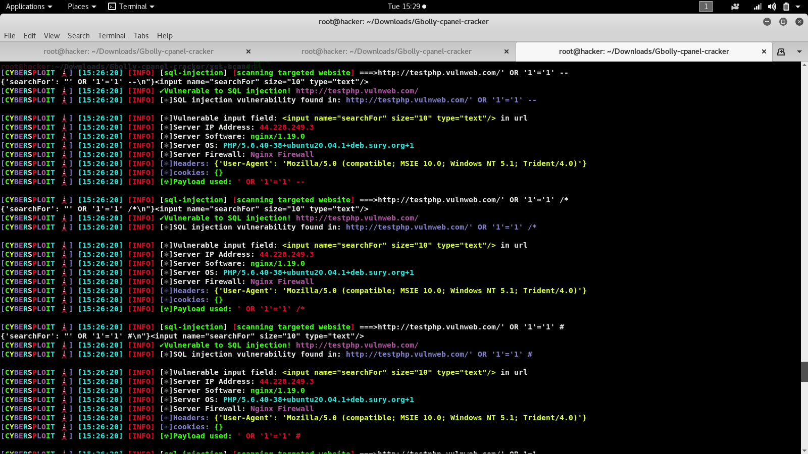
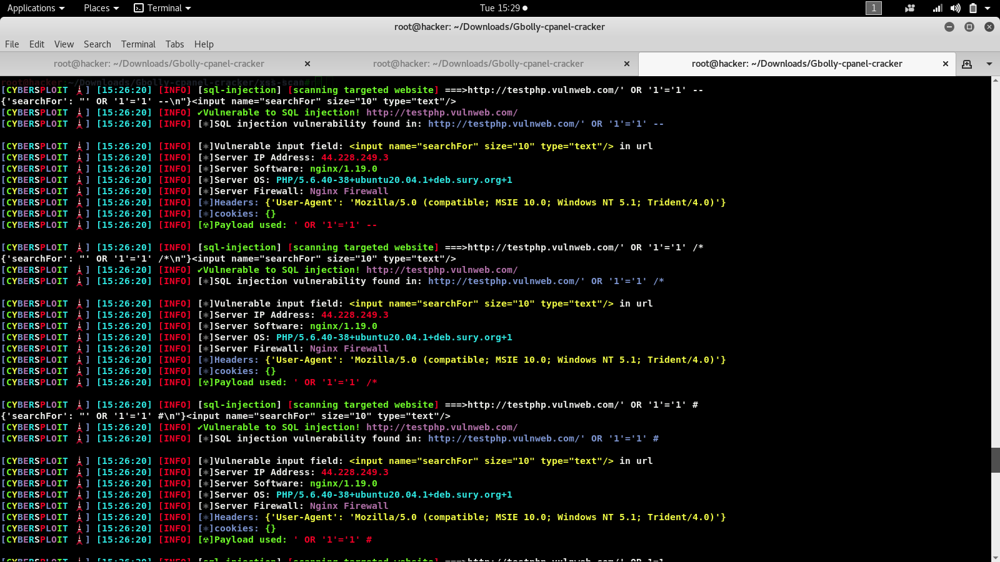
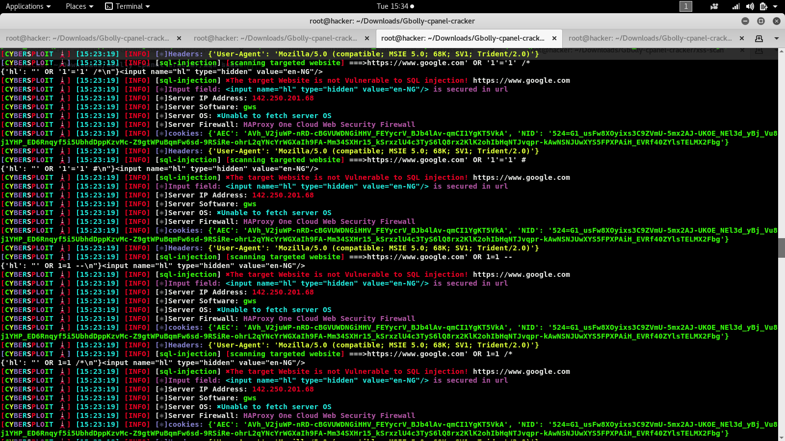
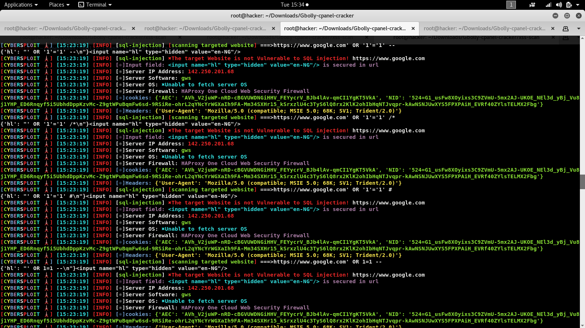
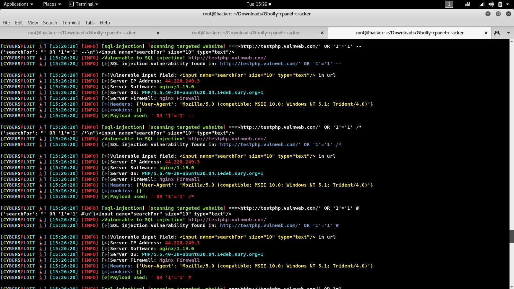
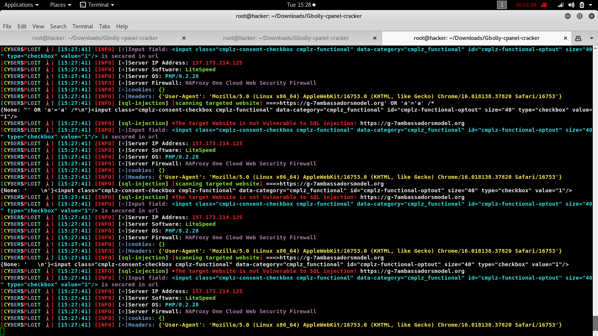
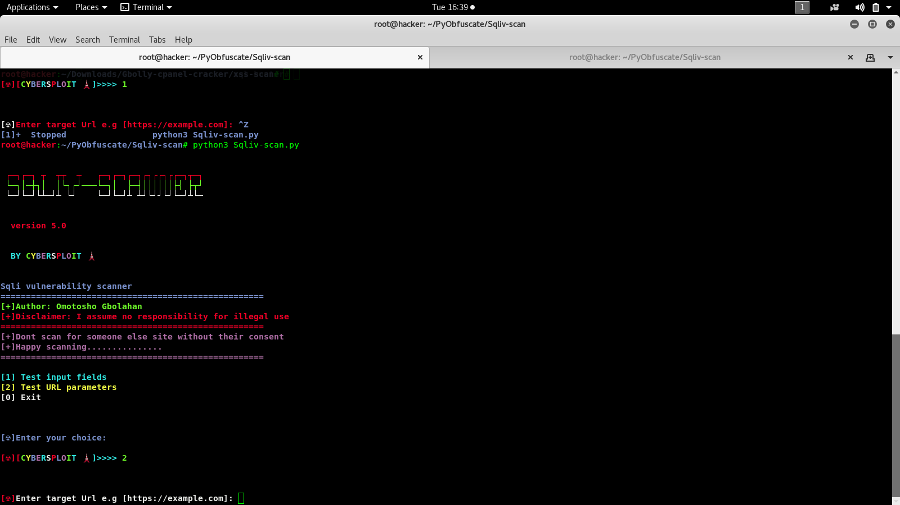
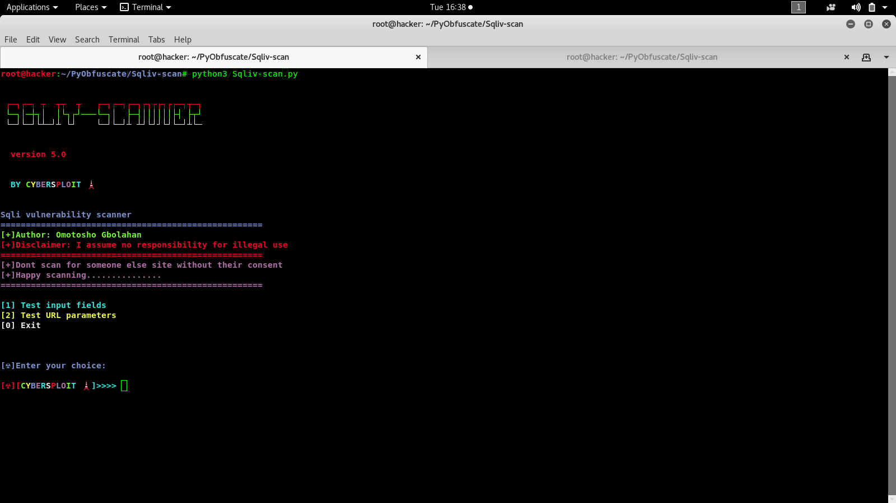

<h1 align="center">Sqliv-scan🔎🔎🔍🔍</h1>
  

 A simple but very powerful sql injection detection tool with over 1500+ predefined payloads 

 Which tests for SQL injection vulnerabilities in query parameters and also finds vulnerability in input fields

 It also identifies and highlights the status of each input fields indicating whether it is "Vulnerable" or "Secure

 Also for vulnerable parameters thus providing information to the user about the potential security risks
 
 Sqliv-scan also detect the web application firewall🔥 (WAF) type the web server is using with the latest and updated firewall🔥 signature list
 
 Sqliv-scan also fetch the web server OS and Server software from the response header and also fetch the web server IP address
 
 It also fetch response cookie headers from the response headers and also switch useragent per session  

 This tool uses 1500+ predefined payloads and 674 wordlist of dorkings to find sql injection vulnerability on a target website  

 You can add more payloads to the payload wordlist and dorkings to the dorking wordlist if you like....

## Features

- Performs sql injection security checks using 1500+ predefined payloads
- Uses 674 wordlist of dorking to find sql injection vulnerability
- Scan for query parameters and indicates whether it is vulnerable or not
- Identifies and highlights the status of each input fields indicating whether it is "Vulnerable" or "Secure
- Can detect if a firewall🔥 is blocking your request or not 
- Can detect rate limiting 
- Fetch the web server OS and Server software from the response header
- Fetch the web server IP address
- Detect the web application firewall🔥 (WAF) type the web server is using the latest and updated firewall🔥 signature list
- Fetch response cookie headers from the response headers
- Switch useragent per session

## Screenshots
 

**Requirements**

- Python 3.x.x
- Required Python packages: 

* re
* ssl
* socket
* random
* requests
* string
* json 
* urlparse
* BeautifulSoup

## Command

  git clone https://github.com/Gbolahanomotosho/Sqliv-scan

  cd Sqliv-scan
 
  pip3 install -r requirements.txt
 
  python3 Sqliv-scan.py

  or

  cd Sqliv-scan

  chmod +x install.sh

  ./install.sh or bash install.sh

## Disclaimer: 

  For educational purpose only......
  
  

  I wont be responsible for any malicious use of this tool.......

